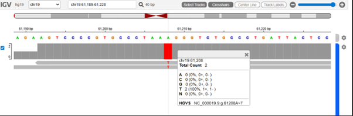

WGS Variant Calling Pipeline

This repository contains a reproducible bioinformatics pipeline for Whole Genome Sequencing (WGS) variant calling on Chromosome 19. This project was developed as part of the Master’s in Computational Health Informatics program (CHIP).

1. Containerization
I used Singularity to Make sure that the trimming step is fully reproducible.

File: trimmomatic.def

build command: apptainer build --fakeroot trimmomatic.sif trimmomatic.def

Purpose: By containerizing Trimmomatic, I avoided version conflicts and ensured the pipeline runs identically across different computing environments.

2. Nextflow workflow
The pipeline is made using Nextflow (DSL2).

process flow: FastQC -> Trimmomatic -> BWA-MEM -> Samtools (BAM) -> FreeBayes (VarCall) -> SQLite3 (Database).

Execution: Run via the run-pipe wrapper or directly:
nextflow run main.nf -resume

3. Database Structure

The final variants are stored in a SQLite3 database (variants.db) for efficient querying.

Table schema:
| Column | Type | Description |
| :--- | :--- | :--- |
| chrom | TEXT | Chromosome name |
| pos | INT | Genomic position |
| ref | TEXT | Reference allele |
| alt | TEXT | Alternative (mutant) allele |
| qual | REAL | Phred-scaled quality score |

4. Visualization (IGV)

Post-processing (sorting and indexing) was performed on the output BAM to facilitate IGV visualization.

Below is a screenshot showing a confirmed mutation on Chromosome 19. The BAM alignment matches the variant stored in the SQLite database.

How to Run
To execute this pipeline , use the following comand:
nextflow run main.nf -profile standard
